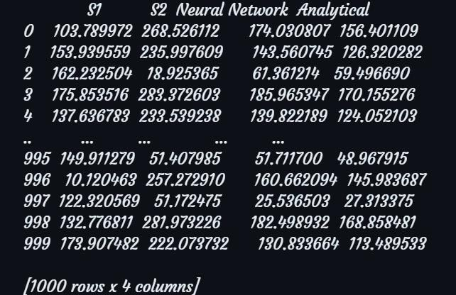

# Deep Learning Option Pricing


## Table of Contents
- [Overview](#overview)
- [Key Concepts](#key-concepts)
- [Implementation Details](#implementation-details)
- [Results](#results)
- [Usage](#usage)
- [Acknowledgements](#acknowledgements)
- [References](#references)

## Overview

This repository presents an innovative exploration into pricing European-style options using Physics-Informed Neural Networks (PINNs) under the Black-Scholes model and its extensions, including stochastic volatility models and jump-diffusion models. By leveraging deep learning techniques, we aim to solve partial differential equations (PDEs) relevant to option pricing, offering a modern and efficient alternative to traditional numerical methods.

Our approach progresses from implementing a basic Neural Network to solve standard PDEs, advancing to non-linear PDEs, and culminating in the application of PINNs to solve the Black-Scholes PDE. The project's pinnacle is the integration of an LSTM layer to tackle multi-asset PDEs, showcasing the versatility and power of deep learning in financial modeling.

**Key Features:**
- Implementation of Neural Networks for solving PDEs
- Application of PINNs to the Black-Scholes model
- Integration of LSTM layers for multi-asset pricing
- Comparative analysis with traditional numerical methods


## Key Concepts

### Introduction to Financial Mathematics

1. **The Black-Scholes Model**
   - Foundation of modern option pricing theory
   - Assumptions and limitations
   - The Black-Scholes-Merton differential equation

2. **Risk-Neutral Pricing**
   - Concept of risk-neutral measure
   - Application in option pricing

3. **The Greeks**
   - Delta, Gamma, Theta, Vega, and Rho
   - Significance in risk management

### Physics-Informed Neural Networks (PINNs)

1. **PDE as Loss Functions**
   - Formulation of the optimization problem
   - Incorporation of physical laws into neural networks

2. **Boundary and Initial Conditions**
   - Techniques for enforcing constraints
   - Soft vs. hard enforcement methods

## Implementation Details

Our project follows a progressive implementation approach:

1. **Basic Neural Network for Standard PDEs**
   - Implementation: `Code.ipynb`
   - Objective: Solve simple, linear PDEs using feedforward neural networks

2. **Neural Network for Non-linear PDEs**
   - Implementation: `Code2.ipynb` and `Code3.ipynb`
   - Objective: Extend the NN approach to handle non-linear PDEs

3. **PINN for Black-Scholes PDE**
   - Implementation: `Code4.ipynb` and `Code5.ipynb`
   - Objective: Apply PINN framework to solve the Black-Scholes equation

4. **LSTM-enhanced PINN for Multi-asset PDEs**
   - Implementation: `Code6.ipynb`, `Code7.ipynb` and `Code8.ipynb`
   - Objective: Integrate LSTM layers to handle temporal dependencies in multi-asset scenarios

## Results

Our implementation yielded promising results, demonstrating the efficacy of deep learning approaches in option pricing. Below are some key visualizations:





For a complete analysis of our results, please refer to the individual notebook files (`CodeX.ipynb`, X denotes week of progress).

## Usage

To run the notebooks:

1. Ensure you have Jupyter installed:
   ```
   pip install jupyter
   ```
2. Launch Jupyter Notebook:
   ```
   jupyter notebook
   ```
3. Navigate to the desired `CodeX.ipynb` file and run the cells sequentially.

## Acknowledgements

I would like to express my deepest gratitude to Dr. Lok Pati Tripathi for his invaluable guidance and support throughout this project. His expertise and insights have been instrumental in shaping the direction and success of this work. This project would not have been possible without his encouragement and mentorship.

## References

1. "Physics Informed Deep Learning (Part I): Data-driven Solutions of Nonlinear Partial Differential Equations" by Maziar Raissi, Paris Perdikaris, and George Em Karniadakis. [Link](https://arxiv.org/abs/1711.10561)

2. "Physics Informed Neural Network for Option Pricing" by Ashish Dhiman and Yibei Hu. [Link](https://arxiv.org/html/2312.06711v1).

3. [PINN](https://github.com/alirezaafzalaghaei/PINN-tutorial)

4. [PDE](https://github.com/keonly/black-scholes-pinn)

5. [DGM](https://github.com/alialaradi/DeepGalerkinMethod)

---

**Note**: This project is part of a B.Tech Project (BTP) and is intended for educational and research purposes. For any commercial use, please consult the appropriate licensing and regulatory requirements.
